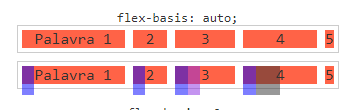

# About

Estudo sobre flexbox, lembrando conceitos e iniciando novamente a jornada em Frontend.

Curso lecionado pelo André Rafael, da Origamid.

# Fundamentos flexbox

[Site referência - Guia Completo Flexbox](https://origamid.com/projetos/flexbox-guia-completo/)

## Tips

Criar um container para o site padrão com uma width definida e ir settando sections dentro desse container.

Utilizar o flex-wrap quando não couber mais conteúdo.

Utilizar o flex-basis para settar um width mínimo para o conteúdo.

# Flex Container x Flex Item

Existem dois tipos de grupo, os containers e os items, começaremos primeiro com todas as propriedades do container.

## Flex Container

### Display

Define o elemento como um flex container, tornando os seus filhos flex-itens.

```css
display: flex;
```

Torna o elemento um flex container automaticamente transformando todos os seus filhos diretos em flex itens.

Veja o exemplo abaixo, o flex foi aplicado na ``section`` (o container - pai), e as divs (filhas) foram alteradas.

#### Antes, com display block

Itens em coluna, os blocks tomam 100% do container (ponta a ponta).


#### Depois, com display flex

Itens alinhados em linha (row), ficam flutuando basicamente. Além disso, o tamanho do item fica exatamente do tamanho
dele.


Como o item ocupa exatamente o seu tamanho, ele pode inclusive, vazar do container:


Para que isso não aconteça, usamos uma outra propriedade: [flex-wrap](#flex-wrap).

### Flex-direction

Define a direção dos itens flex. Por padrão ele fica em linha!

Quando colocamos para column, geralmente acontece quando estamos definindo media queries para sites mobile, assim
você garante que o conteúdo seja apresentado em uma única coluna.

#### flex-direction: row;

Os itens ficam em linha


#### flex-direction: row-reverse;

Os itens ficam em linha reversa, ou seja: 3, 2, 1.


#### flex-direction: column;

Os itens ficam em uma única coluna, um embaixo do outro.


#### flex-direction: column-reverse;

Os itens ficam em uma única coluna, um embaixo do outro, porém em ordem reversa: 3, 2 e 1.


### Flex-wrap

Define se os itens devem quebrar ou não a linha. Conforme citamos acima, por padrão, eles não quebram, fazendo
com o que os flex itens sejam compactados além do limite do container.

Portanto, para não acontecer, utilizamos o flex-wrap: wrap. Assim, quando um item atingir seu limite de conteúdo, o
último item passa para a coluna debaixo e assim por diante.

#### flex-wrap: nowrap;

Valor padrão, não permite a quebra de linha.


#### flex-wrap: wrap

Quebra a linha assim que um dos flex itens não puder mais ser compactado.


#### flex-wrap: wrap-reverse

Quebra a linha assim que um dos flex itens não puder mais ser compactado. A quebra é na direção contrária, ou seja, para
a linha acima.


### Flex-flow

Basicamente declarar se é row/column juntamente com wrap/nowrap.

Atalho para flex-direction e flex-wrap. Geralmente não se use muito, pois quando mudamos a direção para column,
mantemos o padrão do wrap que é **nowrap**.

E quando mudamos o flex-wrap para wrap, mantemos o padrão do flex-direction que é row.


### Justify content

Alinha os itens flex no container de acordo com a sua direção. A propriedade só funciona se os itens atuais não ocuparem
todo o container.

Isso significa o seguinte: ao definirmos flex: 1; ou algo similar nos itens, a propriedade não terá mais função, visto
que o item flex irá preencher todo o seu width.

É uma excelente propriedade para ser usada em casos que você deseja alinhar um item na **ponta esquerda e outro na direita,
como uma header com marca e navegação.**

#### justify-content: flex-start;

Alinha os itens ao início do container.


#### justify-content: flex-end;

Alinha os itens ao final do container.


#### justify-content: center;


Alinha os itens ao centro do container.

#### justify-content: space-between;

Cria um espaçamento igual entre os elementos. Mantendo o primeiro grudado no início e o último no final.


#### justify-content: space-around;

Cria um espaçamento entre os elementos. Os espaçamentos do meio são duas vezes maiores que o inicial e final.


#### justify-content: space-around (com flex: 1)


### Align Items

O align items alinha os flex itens de acordo com o eixo do container. Esse alinhamento é diferente quando os itens estão
em colunas ou linhas.

Essa propriedade permite o tão sonhado alinhamento central no eixo vertical, algo que antes era possível somente com
diferentes "hacks".

#### align-items: stretch (padrão);

Valor padrão, ele que faz com que os flex itens cresçam igualmente (acompanhem a altura, por exemplo).


#### align-items: flex-start;

Alinha os itens ao início. Além disso, passam a ocupar o tamanho deles.


#### align-items: flex-end;

Alinha os itens ao final.


#### align-items: center;

Alinha os itens ao centro. Olha a diferença para o justify content, ele cria espaçamento entre os itens, o align por sua
vez, alinha os itens no eixo do container.


#### align-items: baseline;

Alinha os itens de acordo com a linha base da tipografia. Neste caso, usaram o "1" de referência e alinharam a ele.


### Align Content

Alinha as linhas do container em relação ao eixo vertical (altura). Essa propriedade só funciona se existir mais de uma linha
de flex-itens. **Para isso, o flex-wrap precisa ser wrap.**

Além disso, o efeito dela apenas será visualizado caso o container seja maior que a soma das linhas dos itens.

Isso significa o seguinte: se você não definir o height para o container, a propriedade (align-content), não influencia
no layout.

#### align-content: stretch;

Valor padrão, ele que faz com que os flex itens cresçam igualmente na vertical.


Repare os itens preenchendo todo o container.

#### align-content: flex-start;

Alinha todas as linhas de itens ao início.


#### align-content: flex-end;

Alinha todas as linhas de itens ao final.


#### align-content: center;

Alinha todas as linhas de itens ao centro.


#### align-content: space-between;

Cria um espaçamento igual entre as linhas. Mantendo a primeira grudada no topo e a última no bottom.


#### align-content: space-around;

Cria um espaçamento entre as linhas. Os espaçamentos do meio são duas vezes maiores que o top e bottom.


## Flex Item

Agora, vamos para os flex-itens. São filhos diretos do flex-container, lembrando que uma tag se torna flex-container
a partir do momento que você a define com: display: flex.

É possível que um flex item seja também um flex container, basta definir display: flex nele. Assim, seus filhos também
serão flex itens.

### flex-grow

Define a habilidade de um flex item crescer. **Por padrão, é zero**, assim os flex itens ocupam um tamanho máximo relacionado
o conteúdo interno deles ou ao width que fora definido.

Ao definir 1 para todos os flex itens, **eles tentarão ter a mesma largura e vão ocupar 100% do container**. "Tentarão",
pois caso um elemento possua um conteúdo muito largo, o flex item irá respeitar o mesmo.

Se você tiver uma linha com quatro itens, onde três são flex-grow: 1 e um flex-grow: 2, o flex-grow: 2 tentará ocupar 2
vezes mais espaço extra do que os outros elementos.

**OBS: justify-content não funciona em items com flex-grow definido.**

#### flex-grow: 0 (padrão)

Como se pode observar, os itens são flex e não tentam ocupar mais espaço no container.


#### flex-grow: número;

Basta definir um número.


Repare que do 2 para o 1, não muda absolutamente nada, porque o valor é proporcional. Se todos os itens dessa linha
possuem flex-grow: 2, eles possuem o mesmo tamanho.

Agora, se um item for 1 e outro 2, na mesma linha o 2 vai tentar duas vezes mais.


Já no flex-grow misturado, o 1 possui flex-grow 0, o 2 possui 1 e o 3 possui 2.

Portanto, o número 3 é 2x maior que o número 2. Caso o número 2 fosse também flex-grow: 2, seria o mesmo tamanho do 3.


### flex-basis

Indica o tamanho inicial do flex item antes da distribuição do espaço restante. Lembrando: o espaço restante é definido
pelo flex-grow.

Quando definimos o flex-grow: 1; e possuímos auto no basis, o valor restante para ocupar o container é distribuído ao
redor do conteúdo do flex-item.

Pode usar a função ``calc()`` do css.

#### flex-basis: auto;

Esse é o padrão, ele faz com que a largura da base seja igual a do item. Se o item não tiver tamanho especificado, o
tamanho será de acordo com o conteúdo.



#### flex-basis: unidade;

Pode ser em %, em, px e etc.

É como se fosse um max-width, se precisar ele vai diminuir.

Ao definirmos em px, por exemplo, ele vai sempre respeitar a base declarada, veja:

#### flex-basis: 110px


No exemplo acima, definimos o flex-basis para 110px. O item 1 e 12 possuem uma medida de 112x23. Entretanto, o item
"12345678910" possui 128x23, uma vez que seu conteúdo é maior que os 100px que definimos, portanto, o 110px é uma BASE.

Mas ele sempre vai tentar não ser menor do que o valor definido, é como se fosse um max-width, se precisar ele vai
diminuir.

#### flex-basis: 0;

Usando ele no 0, itens fom flex-grow 1 tentam ficar com o mesmo tamanho total de width. É por isso que basis no 0 é
o mais comum.

Se o flex-grow for igual ou maior que 1, ele irá tentar manter todos os elementos com a mesma largura, independente do
conteúdo (por isso 0 é o valor mais comum do flex-basis). Caso contrário o item terá a largura do seu conteúdo.

### flex-shrink

Define a capacidade de redução de tamanho do item.

#### flex-shrink: 1;

Valor padrão, permite que os itens tenham os seus tamanhos (seja esse tamanho definido a partir de width ou flex-basis)
reduzidos para caber no container.


#### flex-shrink: 0;

Não permite a diminuição dos itens, assim um item com flex-basis: 300px; nunca diminuirá menos do que 300px, mesmo que o
conteúdo não ocupe todo esse espaço.

#### flex-shrink: número;

Um item com shrink: 3 diminuirá 3 vezes mais que um item com 1.

### flex (tudo declarado junto)

Atalho para as propriedades flex-grow, flex-shrink e flex-basis. Geralmente você verá a propriedade flex nos flex itens
ao invés de cada um dos valores separados.

Para melhor consistência entre os navegadores, é recomendado utilizar a propriedade flex ao invés de cada propriedade separada.

No exemplo é possível ver as mesmas configurações do exemplo do flex-basis, porém agora utilizando apenas a propriedade flex.

#### flex: 1;

Define flex-grow: 1; flex-shrink: 1; e flex-basis: 0; (em alguns navegadores define como 0%, pois estes ignoram valores sem
unidades, porém a função de 0 e 0% é a mesma.)

#### flex: 0 1 auto (padrão);

Esse é o padrão, se você não definir nenhum valor de flex ou para as outras propriedades separadas, o normal será
flex-grow: 0, flex-shrink: 1 e flex-basis: auto.

#### flex: 2;

Define exatamente da mesma forma que o flex: 1; porém neste caso o flex-grow será de 2, o flex-shrink continuará 1
e o flex-basis 0.

#### flex: 3 2 300px;

flex-grow: 3, flex-shrink: 2 e flex-basis: 300px;

### order

Modifica a ordem dos flex itens. Sempre do menor para o maior, assim order: 1, aparece na frente de order: 5.

#### order: número;

Número para modificar a ordem padrão. Pode ser negativo.

#### order: 0;

0 é o valor padrão e isso significa que a ordem dos itens será a ordem apresentada no HTML. Se você quiser colocar um
item do meio da lista no início da mesma, sem modificar os demais, o ideal é utilizar um valor negativo para este item,
já que todos os outros são 0.

### align-self

O align-self serve para definirmos o alinhamento **específico de um único flex item** dentro do nosso container. Caso um
valor seja atribuído, ele passara por cima do que for atribuído no align-items do container.

Vale lembrar que o alinhamento acontece tanto em linha quanto em colunas.

Por exemplo, o flex-start quando os itens estão em linhas, alinha o item ao topo da sua linha. Quando em colunas,
alinha o item ao início (esquerda) da coluna.


#### align-self: auto;

Valor inicial padrão. Vai respeitar o que for definido pelo align-items no flex-container.

#### align-self: flex-start;

Alinha o item ao início.

#### align-self: flex-end;

Alinha o item ao final.

#### align-self: center;

Alinha o item ao centro.

#### align-self: baseline;

Alinha o item a linha de base.


Veja que o item 1 recebeu o baseline e item 2 se alinhou utilizando sua linha de base.

#### align-self: stretch;

Estica o item.
